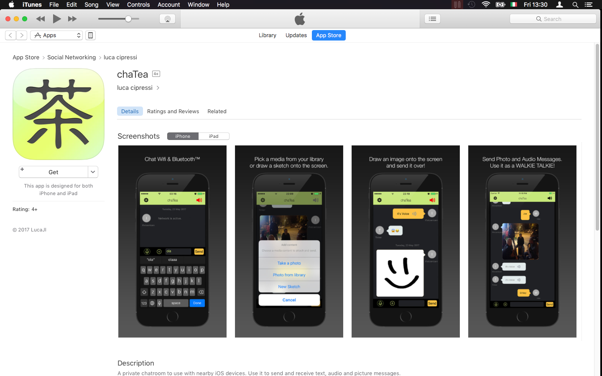

# chatea

A native iOS messaging mobile app with Walkie/Talkie function and support for hand-drawn sketches.

## OVERVIEW

This is a native iOS Messenger app, with realtime chat conversations that support text, audio and photo/hand-drawn images.

## KEY FEATURES (2018)

- text messages
- audio messages with walkie-talkie function (auto play)
- photo support
- hand-drawn sketches
- amnesic data-store - not seriously, but if you quit the app, you lose the transcripts :)

## REQUIREMENTS

The project was last updated in 2018, therefore still supports older iOS versions.

- iOS 9+

## CONTACT

If you have any questions or ideas you can contact me via GitHub Pages (https://lucaji.github.io), or via lucaji  ]at[  mail.ru.

## LICENSE

Since March 2021, I could find enough time to clean up and release the full source of the project under a GPL3 (or later) license. A full copy of it is included in the repository.

    chatea - messaging mobile app
    Copyright (C) 2015-2021  Luca Cipressi [lucaji][@][mail.ru]

    This program is free software: you can redistribute it and/or modify
    it under the terms of the GNU General Public License as published by
    the Free Software Foundation, either version 3 of the License, or
    any later version.

    This program is distributed in the hope that it will be useful,
    but WITHOUT ANY WARRANTY; without even the implied warranty of
    MERCHANTABILITY or FITNESS FOR A PARTICULAR PURPOSE.  See the
    GNU General Public License for more details.

    You should have received a copy of the GNU General Public License
    along with this program.  If not, see <https://www.gnu.org/licenses/>
    

## DISCLAIMER

This is an archived project going back to 2018 and since then not being maintained anymore. Future development might or might not be resumed, as there are already other (way) better projects out there.

